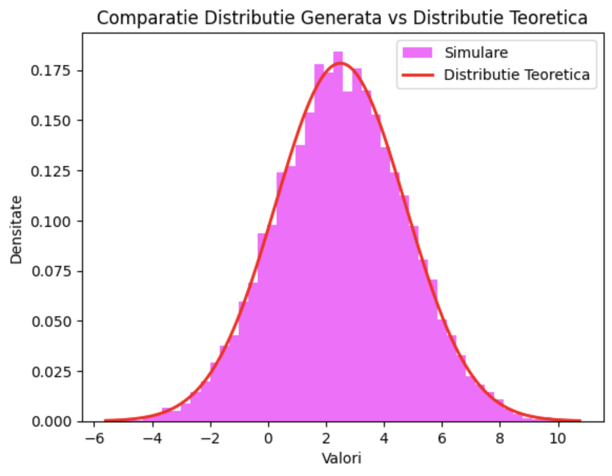
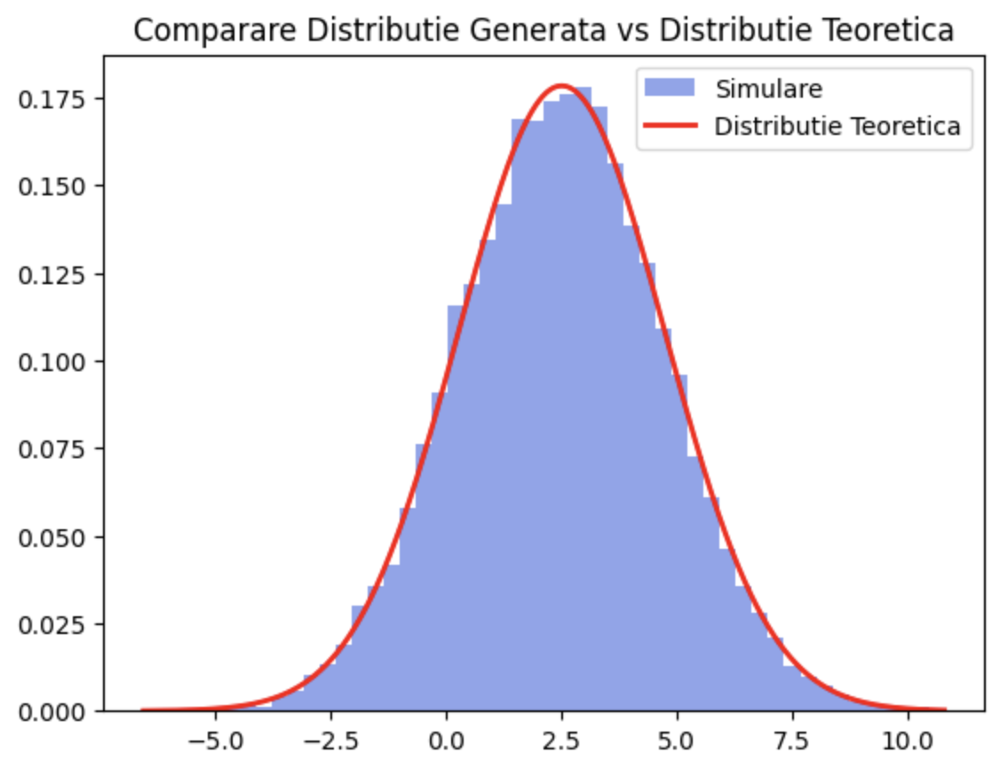
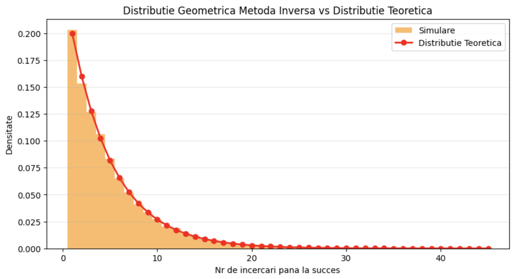
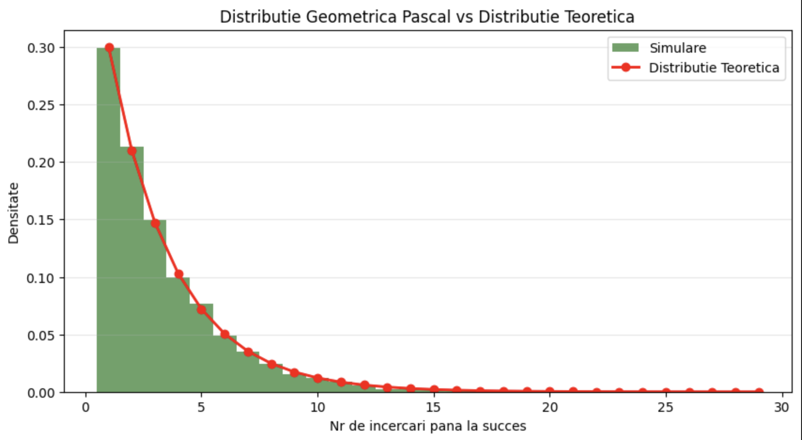

# Generarea Variabilelor Normale si Geometrice

### Tema 2 - Tehnici de Simualre

Sa se genereze variabila normala N (2.5,5) cu ajutorul limitei centrale si cu ajutorul metodei polare. 
Sa se genereze variabila geometrica prin doua metode.

# 📊 Concluzii

## 1. Generarea Variabilei Normale

### **1.1 Metoda Limitei Centrale (CLT)**  
- **Principiu:** Folosește suma variabilelor uniforme independente pentru a aproxima o distribuție normală.  
- **Avantaje:** Simplă, ușor de implementat.  
- **Dezavantaje:** Necesită un număr mare de variabile uniforme pentru precizie.  

**Observație:** Histograma a arătat o distribuție apropiată de curba teoretică, iar media și varianța au fost validate numeric.

### **1.2 Metoda Polară (Box-Muller)**  
- **Principiu:** Transformă două variabile uniforme în două variabile normale independente.  
- **Avantaje:** Rapidă, precisă.  
- **Dezavantaje:** Necesită validarea condiției pentru valori uniforme.  

**Observație:** Histograma și curba teoretică s-au suprapus mai bine.

**Concluzie:** Metoda Polară este mai precisă și mai eficientă decât metoda CLT.

---

## 2. Generarea Variabilei Geometrice

### **2.1 Metoda Inversării Funcției de Repartiție**  
- **Principiu:** Transformă o variabilă uniformă într-o variabilă geometrică folosind funcția de repartiție inversă.  
- **Avantaje:** Directă, eficientă.  
- **Dezavantaje:** Necesită calcul logaritmic.

**Observație:** Histograma s-a aliniat bine cu distribuția teoretică.

### **2.2 Metoda Pascal (Simulare Directă prin Bernoulli)**  
- **Principiu:** Numără încercările Bernoulli până la primul succes.  
- **Avantaje:** Intuitivă, clară.  
- **Dezavantaje:** Ineficientă pentru valori mici ale probabilității \( p \).  

**Observație:** Histograma și curba teoretică au fost bine aliniate.

**Concluzie:** Metoda Inversării este mai eficientă pentru seturi mari de date, în timp ce metoda Pascal este mai intuitivă.

---

## 3. Comparare între Metode

| **Metodă** | **Tip Distribuție** | **Avantaje** | **Dezavantaje** |
|------------|----------------------|-------------|-----------------|
| **Limita Centrală** | Normală | Simplă, intuitivă | Necesită multe valori uniforme |
| **Metoda Polară** | Normală | Rapidă, precisă | Complexitate moderată |
| **Metoda Inversării** | Geometrică | Directă, eficientă | Necesită calcul logaritmic |
| **Metoda Pascal** | Geometrică | Intuitivă, clară | Ineficientă pentru valori mici ale probabilității |

**Observație:**  
- Pentru **distribuția normală**, **Metoda Polară** este preferată pentru eficiență.  
- Pentru **distribuția geometrică**, **Metoda Inversării** este mai eficientă, iar **Metoda Pascal** este mai intuitivă.
